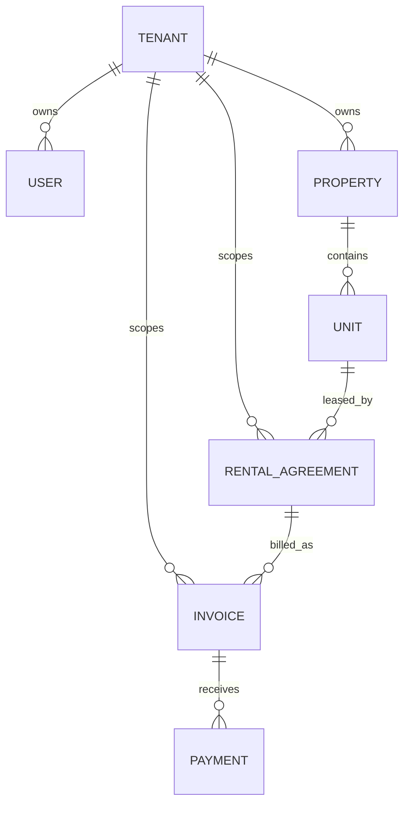

# Database Audit

**Scope:** Static review of `apps/api/prisma/schema.prisma`; no database connection or migration was run.

## 1. Executive Summary

The schema defines 13 PostgreSQL tables for a multi-tenant rental platform. It has useful UUID keys, tenant identifiers, selected tenant-leading indexes, decimal money fields, and invoice-period uniqueness. It is not production ready: no migrations exist, tenant isolation is application-conventional rather than database-enforced, many logical identifiers lack foreign keys, and key accounting/document/payment lifecycle tables are absent.

## 2. Database Overview

- **Engine:** PostgreSQL 16 Alpine image, accessed through Prisma 6.
- **Naming:** Prisma PascalCase models map to plural snake_case tables.
- **Keys:** UUID strings generated by Prisma.
- **Tenancy:** `tenantId` is present on most business tables, but no PostgreSQL RLS or tenant context enforcement exists.
- **Migrations:** None committed (`prisma/migrations` is absent).

## 3. Every Table

| Table (model) | Purpose / columns | PK | Foreign keys / relationships | Unique constraints / indexes | Soft delete / audit columns |
|---|---|---|---|---|---|
| `tenants` (`Tenant`) | Tenant account: `id`, `name`, `createdAt` | `id` | Referenced by users, properties, agreements, invoices | PK only | No soft delete; `createdAt` only |
| `users` (`User`) | Identity: tenant, email, password hash, name, role, refresh hash, active flag, timestamps | `id` | `tenantId → tenants.id` | Unique `(tenantId,email)`; index `(tenantId,role)` | `isActive` is not soft delete; `createdAt`, `updatedAt` |
| `properties` (`Property`) | Property name/address JSON | `id` | `tenantId → tenants.id`; one-to-many units | Index `(tenantId)` | No soft delete; `createdAt` |
| `units` (`Unit`) | Unit code/status and property/tenant identifiers | `id` | `propertyId → properties.id`; one-to-many agreements. `tenantId` is not relationally linked | Unique `(propertyId,code)`; index `(tenantId)` | No soft delete/audit timestamps |
| `rental_agreements` (`RentalAgreement`) | Lease: tenant, unit, landlord/tenant identifiers, lifecycle, rent/GST, dates, auto-invoice settings | `id` | `tenantId → tenants.id`; `unitId → units.id`; one-to-many invoices. `landlordId` and `tenantUserId` have no FK | Index `(tenantId,status)`; `(autoInvoiceEnabled,status)` | Lifecycle timestamps `vacatedAt`/`cancelledAt`; no created/updated timestamps, no soft delete |
| `gst_profiles` (`GstProfile`) | GST legal identity, GSTIN, state, address/default | `id` | `tenantId` is scalar only; no `Tenant` relation | Unique `(tenantId,gstin)` | No timestamps/soft delete |
| `invoice_templates` (`InvoiceTemplate`) | Tenant invoice template JSON/default flag | `id` | `tenantId` is scalar only | Unique `(tenantId,name)` | No timestamps/soft delete/versioning |
| `invoices` (`Invoice`) | Issued invoice: tenant/agreement, number/status, dates, totals, snapshot | `id` | `tenantId → tenants.id`; `agreementId → rental_agreements.id`; one-to-many payments | Unique `(tenantId,number)` and `(agreementId,billingPeriodStart)`; index `(tenantId,status,dueDate)` | No soft delete; `createdAt` only |
| `payments` (`Payment`) | Invoice payment amount/status/provider/reference/date | `id` | `invoiceId → invoices.id`; `tenantId` scalar only | Index `(tenantId,status)` | No created/updated/deleted timestamps |
| `maintenance_requests` (`MaintenanceRequest`) | Request unit/raiser/title/description/status/priority | `id` | `unitId`, `raisedBy`, `tenantId` are scalar only | Index `(tenantId,status)` | No soft delete; `createdAt` only |
| `documents` (`Document`) | Object metadata: owner type/id, storage key, name/mime | `id` | Polymorphic owner and tenant are scalar only | Index `(tenantId,ownerType,ownerId)` | No soft delete; `createdAt` only |
| `notifications` (`Notification`) | User channel/template/payload/send status | `id` | `tenantId`, `userId` scalar only | Index `(tenantId,status)` | No `createdAt`; `sentAt` only |
| `audit_logs` (`AuditLog`) | Mutation/audit event with actor/entity/metadata/trace | `id` | Tenant/actor/entity are scalar/polymorphic | Index `(tenantId,entityType,entityId)` | Append-only intention only; `createdAt`; no immutability enforcement |

## 4. Relationship Diagram

The diagram intentionally excludes scalar identifiers without foreign-key relations: agreement landlord/tenant user, GST profiles, templates, maintenance, documents, notifications, and audit actors.

## 5. Tenant Isolation Strategy

Current strategy is application filtering: controllers carry JWT `tenantId`; services manually use it in some Prisma `where` clauses. Schema tables usually contain `tenantId`, and several indexes lead with it.

Strength: invoices and agreement status lookup explicitly query `(id,tenantId)`. Weakness: no central tenant repository, middleware, database RLS, composite foreign keys, or constraint ensures related records share a tenant. Any missed `tenantId` filter can become a cross-tenant data disclosure/write.

## 6. Multi-tenancy Review

| Area | Assessment |
|---|---|
| Tenant identifier coverage | Good baseline: most operational tables contain `tenantId`. |
| Database enforcement | Absent: no RLS, tenant session variable, tenant composite foreign keys, or triggers. |
| Relationship consistency | Weak: `Unit.tenantId` can disagree with its property; agreement/payment identifiers can reference another tenant. |
| Query convention | Inconsistent: only implemented service methods show tenant filters. |
| Recommended model | Retain shared-schema tenancy, add central tenant-scoped repositories and PostgreSQL RLS as defence in depth. |

## 7. Normalization Review

- Core tenant/property/unit/agreement/invoice/payment entities are broadly normalized.
- `address`, `content`, `snapshot`, `payload`, and `metadata` JSON fields are appropriate for immutable snapshots/flexible payloads but require query/index discipline.
- Invoice lacks normalized invoice lines, tax components, profile/template reference, and immutable rendered document reference.
- Polymorphic document/audit ownership trades referential integrity for flexibility; use explicit link tables or strict application validation where lifecycle matters.
- Notification channel/template/payload should eventually normalize delivery attempts/status history.

## 8. Missing Tables

- `invoice_line_items`, tax breakdowns (CGST/SGST/IGST), invoice sequence/number allocation, credit notes.
- `user_sessions`/refresh-token sessions, invitations, password-reset/email-verification tokens, MFA factors.
- Tenant membership/role history and permissions.
- Payment gateway transactions, webhook events, idempotency keys, reconciliation/refunds/receipts.
- Notification delivery attempts, device tokens, notification preferences, template versions.
- Document versions, access grants, scan results, retention/deletion jobs.
- Maintenance comments, assignments, work orders, vendors, attachments.
- Subscription plans, subscriptions, entitlements, billing events.
- Outbox/domain events, job execution history, scheduled invoice run/idempotency records.

## 9. Missing Indexes

- `rental_agreements(tenantId, unitId, status)` for unit availability/lifecycle queries.
- `rental_agreements(tenantId, landlordId)` and `(tenantId, tenantUserId)` after FKs exist.
- `payments(invoiceId)` and `(tenantId, provider, reference)` unique where provider references permit it.
- `maintenance_requests(tenantId,unitId,status,createdAt)` for operations lists.
- `notifications(tenantId,userId,status,createdAt)`; add `createdAt` first.
- `documents(tenantId,storageKey)` unique and `documents(tenantId,createdAt)` if listing.
- `audit_logs(tenantId,createdAt)` and `(actorId,createdAt)` for investigations.
- Search indexes should be introduced only after defined search requirements (e.g., PostgreSQL full text/trigram).

## 10. Missing Constraints

- Foreign keys from every tenant-owned scalar identifier to its owner/entity.
- Composite tenant-consistency controls: unit/property, agreement/unit, invoice/agreement, payment/invoice, notification/user.
- `CHECK (rentAmount >= 0)`, `CHECK (gstRate >= 0 AND gstRate <= 100)`, positive payment amounts, and valid date ranges.
- Agreement status transition enforcement and an active-agreement/unit exclusivity rule.
- Default GST/template uniqueness per tenant (partial unique index).
- One default invoice template/profile per tenant; one active agreement per unit if required.
- Invoice totals/tax integrity constraints or immutable line-item calculation strategy.
- `NOT NULL createdAt` fields on notifications/payments/templates/profiles where operational tracing requires them.

## 11. Performance Review

Current indexes help basic tenant/status queries. Risks are missing indexes for payment/reconciliation, operational lists, audit queries, and relationship joins. JSON fields could become expensive if used for filtering without GIN/expression indexes. No connection-pool settings, query telemetry, pagination conventions, archival/partitioning, or workload evidence exists. The audit log and notification tables will grow indefinitely and need retention/partition/archive policy.

## 12. Migration Review

There is no `prisma/migrations` directory or committed migration history. Prisma schema changes cannot be reproduced, reviewed, rolled forward, or rolled back safely. Production `db push` must not be used as the long-term schema process. Establish reviewed, committed migrations; run `migrate deploy` in release automation; and test backup/restore plus migration on a production-like copy.

## 13. Data Integrity Review

The schema provides UUID keys and selected uniqueness, but application-level references bypass database integrity. Invoice uniqueness prevents one agreement/month duplicate but does not ensure legal invoice-number sequencing or payment integrity. Audit logs are writable and not tamper-evident. No optimistic concurrency/version fields exist, so concurrent status/payment updates can overwrite each other. Critical financial state requires transactions, idempotency records, provider-event uniqueness, and immutable accounting artifacts.

## 14. Backup Considerations

- PostgreSQL data is persisted in a named Docker volume, but no backup job is defined.
- Use encrypted logical `pg_dump` backups with point-in-time recovery/WAL strategy proportional to RPO/RTO.
- Store backups off-VPS, monitor success/failure, and test restore at least quarterly.
- Back up Prisma migrations, deployment configuration, secrets-management records, and document object storage separately.
- Never rely only on copying a live PostgreSQL volume.

## 15. Recommendations

1. Create and commit an initial Prisma migration before production data is accepted.
2. Add missing foreign keys, tenant-consistency controls, timestamps, check constraints, and financial idempotency tables through reviewed migrations.
3. Implement central tenant-scoped data access and PostgreSQL RLS defence in depth.
4. Add invoice line items/tax components and payment/webhook/reconciliation models before payment launch.
5. Add operational indexes after list/query contracts are defined and measure queries with PostgreSQL telemetry.
6. Define archival/retention policies for audit logs, notifications, and documents.
7. Establish encrypted off-server backups, restore drills, and RPO/RTO ownership.
